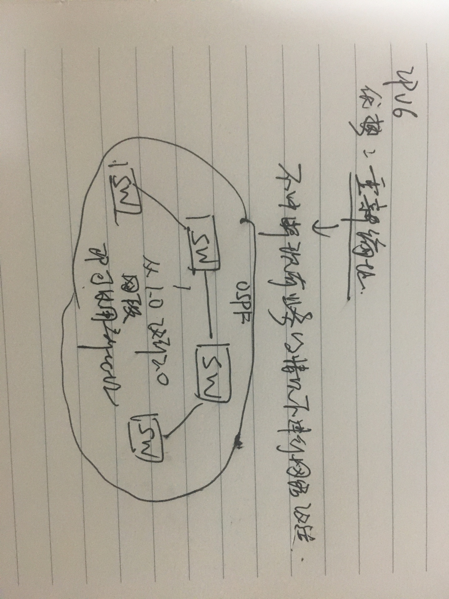

# ipv6学习笔记

### 为什么ipv6没有推广

* 可以解决地址不够用的方法：

  1、nat/napt

  2、cidr

* 没有杀手级应用: **物联网、5g**时代的来临，ipv6变得很重要

### ipv6技术特点，与ipv4相比

1. 地址空间巨大
2. 报文结构精简
3. 自动配置和重新编址

   

4. 层次化网络编址，因为长度。

   ipv4也有，但能力很弱，因为地址长度短（32）ipv6是128 bit，支持更多层次的划分

5. 支持端对端安全

   原生支持IPSec-VPN，在应用层面直接使用。ipv4需要配置隧道支持IPSec，配置繁琐，还有nat的问题。

### ipv6地址格式

* ipv4地址表示格式：
* 二进制
* 点分十进制；又分为掩码表示和前缀表示

  192.168.1.1 255.255.255.0和192.168.1.1/24

* ipv6地址表示格式
* 二进制
* 16进制 /前缀长度

  2001:1:1:1/64

